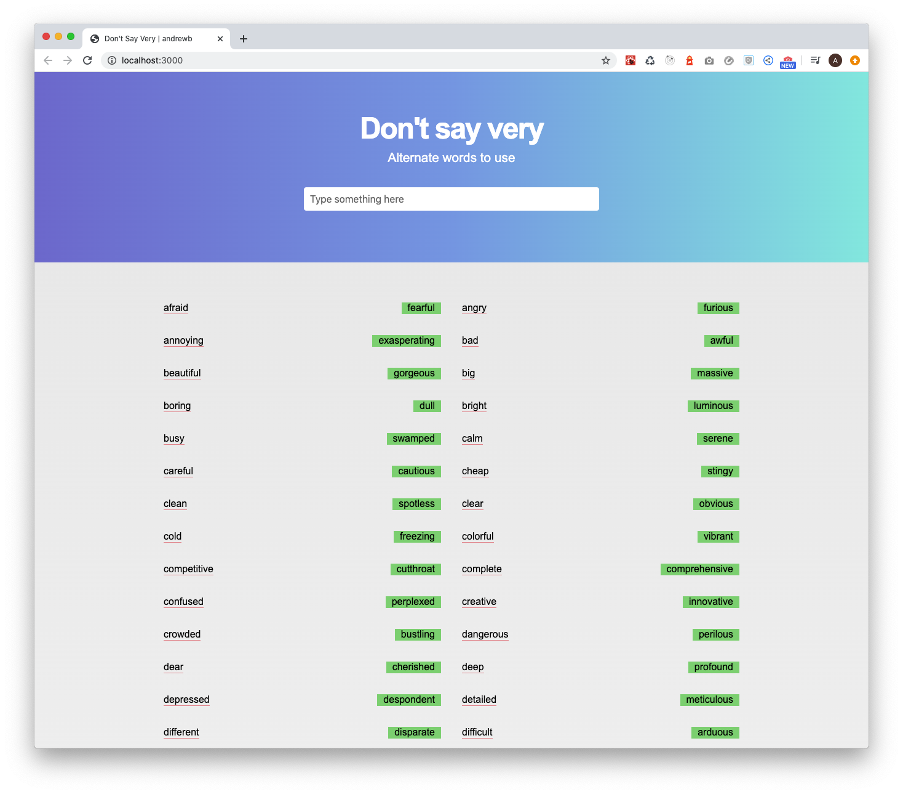
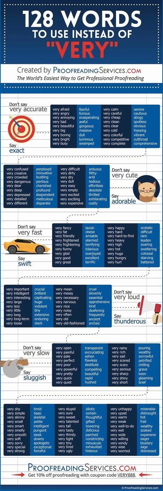

# Don't say very
Demo: [https://dont-say-very-andrewb.netlify.app/](https://dont-say-very-andrewb.netlify.app/)

# Inspiration
This app was inspired by an image I saw online.

# Background
This is Day 8/100 of my #100DaysOfCode challenge on Twitter: [@andrewbdesign](https://twitter.com/andrewbdesign)

My focus was to build something where you can filter out the words from the input text field. Also it was my first time trying out typescript in react and using styled components.

# Local dev setup
In the project directory, you can run:

### `npm install`

This will install the necessary packages.

### `npm start`

Runs the app in the development mode. 
Open [http://localhost:3000](http://localhost:3000) to view it in the browser.

### `npm run build`

Builds the app for production to the `build` folder. 
